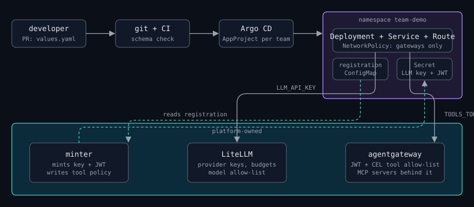

+++
title = 'A Golden Path for Agents'
date = 2026-09-06
summary = "Developers and non-developers kept showing up with vibe-coded agents and asking how to get them to production. Here is the platform answer: one values file, a PR, and an agent that cannot leak a key, blow a budget, or call a tool it was not given."
tags = ["platform-engineering", "kubernetes", "ai", "gitops"]
draft = false
+++

Platform engineering has one trick, and it works almost everywhere you point
it. Find the thing every team keeps rebuilding, build it once with safe
defaults, leave a few knobs, and put guard rails around the knobs. That is
what a universal Helm chart is for deployments, what hardened base images are
for containers, and what shared GitHub Actions are for CI. Eighty percent of
teams never need anything else, and the other twenty get an escape hatch and
a review.

Then agents showed up, and for a while the trick had no answer.

The people asking were not the usual suspects, either. A support lead had a
prompt and wanted it to read tickets. An analyst had a Python script that
called a model and ran generated code over CSV files. A developer had a small
chat app that worked great on a laptop. Nobody in that group wanted to learn
about workload identity or egress policy, and every one of them was about a
day away from pasting an API key into a Deployment.

So what does the golden path look like for this? I spent a week finding out
and then building it, and the whole thing now lives in
[one public repo](https://github.com/dackota/agent-golden-path) that runs end
to end on a laptop. This post is what I learned along the way.

## What an agent needs that an app does not

Strip away the hype and an agent is a service with three extra habits. It
spends money on every request, it calls tools that can change things, and it
was probably written by someone who does not think of themselves as a backend
engineer. None of those are hard on their own, but together they are exactly
the gaps a normal app chart does not cover.

The research phase ([full notes here](https://github.com/dackota/agent-golden-path/blob/main/docs/research/2026-09-05-agent-deployment-golden-path.md))
turned up no standard for deploying agents, just a set of parts that are
starting to converge. The MCP spec now treats tool servers as OAuth resource
servers. OpenTelemetry has draft conventions for agent and tool spans. OWASP
published a top ten for agents in December 2025. And the companies actually
running agents at scale have all built roughly the same thing: a thin layer on
the platform they already had, with a gateway sitting in front of models and
tools. Uber gives each agent a workload identity and routes every tool call
through one MCP gateway. Stripe runs its coding agents in sandboxes with no
internet and keeps a human on every PR.

What none of them did was buy a hosted agent runtime for the default path, and
neither did I. The org already had Kubernetes, Helm, Argo CD, and GitHub
Actions, so agents became one more workload type, one that happens to have a
stateful process, a gateway dependency, and a budget.

## What the developer sees

This is the entire contract:

```yaml
# deployments/agents/demo/vibe-app/values.yaml
name: vibe-app
team: demo
owner: dackota.j@gmail.com
description: A chat app that calls an LLM and one read-only tool.
kind: container
image: ghcr.io/dackota/agent-app-template:0.2.0
systemPrompt: You are a friendly helper. Keep answers under 30 words.
tools:
  - name: k8s-readonly
budget:
  usdPerMonth: 10
```

Open a PR with that file and CI renders it against the chart schema, failing
with the exact field name if something is off. Merge it, and about a minute
later the agent is answering at `/agents/demo/vibe-app/` on the platform
gateway. It can call three read-only Kubernetes tools, it can spend ten
dollars a month, and at no point did anyone hand it a credential.

The `kind` field is the one big switch. `prompt` is a system prompt plus tools
and no code at all, which is what the support lead needed. `container` is your
own image, for the developer with the chat app. `codeexec` hands you an
isolated sandbox from a warm pool, which is where the analyst's script
belongs. One chart renders all three, and it only renders the resources a
single agent needs. Anything shared or privileged lives outside the chart, and
outside the team's reach.

## What the platform does



The core idea is that two gateways hold every credential, so the agents never
have to. [LiteLLM](https://docs.litellm.ai/) is the LLM gateway. It keeps the
real provider keys and hands each agent a virtual key with a hard
`max_budget`, a model allow-list, and rate limits, and because spend is
tracked per key, cost per agent and per team falls out for free.
[agentgateway](https://agentgateway.dev/) is the tool gateway. It sits in
front of the MCP tool servers, requires a JWT, and applies one small CEL policy
per agent that says which tool names exist for it. Tools outside that list
are simply absent from `tools/list`, so the model cannot try what it cannot
see.

A NetworkPolicy then makes those two gateways, plus DNS, the only things an
agent pod can reach. I tested this the boring way: a pod with the policy could
not reach the model host directly, the same pod could reach the gateway, and a
control pod without the policy reached the model host just fine.

The piece that makes GitOps actually work here is a small minter. The chart
renders a registration ConfigMap for every agent, and a platform CronJob reads
them, mints the LLM key and the tool JWT, writes both into a Secret in the team
namespace, and applies the tool policy. Pods wait for the Secret and then
start. Delete the folder and the minter deletes the Secret and the policy
along with it. It is eighty lines of stdlib Python, and it is the only process
anywhere that ever touches the master key.

Argo CD ties all of it together with a git-directory `ApplicationSet` over
`deployments/agents/*/*` and one `AppProject` per team. The project allows one
source repo and one destination namespace and forbids cluster-scoped
resources, and I spent a while trying to break it. An Application aimed at
another namespace was refused. An Application from a foreign repo was refused.
When Argo tried to create a namespace on the team's behalf, the project
refused that too, which is how I learned that namespaces belong in
platform-owned files.

## The guard rails, and how I know they hold

Every rail was tested, and the failing test sits next to the rule in
[docs/guard-rails.md](https://github.com/dackota/agent-golden-path/blob/main/docs/guard-rails.md).
The short version:

| Rule | Proof |
|---|---|
| Only catalog models, only catalog tools, only allowed registries, no `:latest` | eleven bad values files, all rejected before render |
| Hard budget per agent | a key with a $0.0001 budget: first call ok, second call "Budget has been exceeded" |
| Per-agent tool allow-list | one token lists 3 Kubernetes tools, another lists 3 order tools, same endpoint |
| Default-deny egress | pod to model host: unreachable. Pod to gateway: 200 |
| Human approval on writes | "Cancel order 1004" stopped in `input-required`; the order was untouched |
| Delegation needs consent | an agent in an unlisted namespace named another team's agent as a tool: refused |
| Removal is complete | deleted a folder: CronJob, ConfigMaps, and the minted Secret all gone |

The one I keep coming back to is the approval gate. A `prompt` agent that
lists the `orders-cancel` tool with `approval: true` will stop and wait for a
human before the tool runs, and that pause is the whole difference between an
agent that can cancel orders and an agent that can ask to.

## Two things that make agents a system

Tools that only search the web are not that interesting. The tools worth
having are the company's own APIs, so the repo ships with a fake Orders REST
API and a ninety-line MCP server that wraps it with no framework at all: one
tool per API call, a JSON schema per tool, and the HTTP call inside. kagent's
`MCPServer` resource deploys it, a `RemoteMCPServer` shares it with agent
namespaces, and the same server shows up as a second target on the tool
gateway so container agents can reach it through the JWT check. Wrapping the
next API is a copy of one file.

The other half is that agents should not know how to do everything. They
should know who to ask. [kagent](https://kagent.dev/) lets an `Agent` list
another `Agent` as a tool, with the call going over A2A between pods, and in
values that is one line on each side. The caller says
`tools: [{agent: ops/orders-agent}]` and the callee says
`delegation: {allowFromTeams: [demo]}`. Both have to agree, kagent enforces
the callee's half, and when I asked the concierge in one team about an order,
it went and asked the specialist in another team and the response history
showed the hand-off.

## Things that bit me

Helm's schema validator is Go regex, which means no lookahead. My `(?!latest)`
compiled nowhere and failed every single render with an error about the
schema rather than the values. `not` with a pattern does the job instead.

Anything rendered from `now` makes Argo permanently OutOfSync. I wanted
sandboxes to expire eight hours after creation, and they now take an explicit
timestamp instead.

agentgateway starts prefixing tool names the moment a backend has two targets,
so `k8s_get_resources` quietly became `kagent-tools_k8s_get_resources` and the
model happily called it by the new name. `prefixMode: Never`, plus a rule that
catalog names may not collide.

kgateway 2.4 does not bundle agentgateway any more. My research note said
"agentgateway behind kgateway" because 2.1 did, but agentgateway ships its own
Gateway API control plane now. Re-check the install docs the day you install,
not the week before.

And a public repo cannot call a reusable workflow that lives in a private one,
which I found out when the template repo's first build failed in zero seconds.
The shared build workflow moved to a public repo and that was that.

## What is still missing

This is a proof of concept on kind, and the README says so plainly. For a real
cluster, the org identity provider becomes the JWT issuer instead of a
platform RSA key, the sandbox template turns on gVisor, image signatures get
verified at admission rather than only in CI, an OpenTelemetry collector lands
where the chart already points, and the minter grows up into a controller with
a watch, or gets replaced by External Secrets Operator. Each of those is
listed next to its local stand-in in the
[platform guide](https://github.com/dackota/agent-golden-path/blob/main/docs/platform-guide.md).

What I would not change is the shape. One values file. Two gateways that own
the credentials. A minter that turns "this agent exists" into "this agent has
keys". A project boundary that Argo enforces so the platform does not have to
argue about it. The developer gets a URL and a budget, and the platform gets
the same agent every time.

The repo is at [github.com/dackota/agent-golden-path](https://github.com/dackota/agent-golden-path),
and `make up` builds the whole thing on a laptop with a local model. Every
claim in this post has a test sitting next to it.
